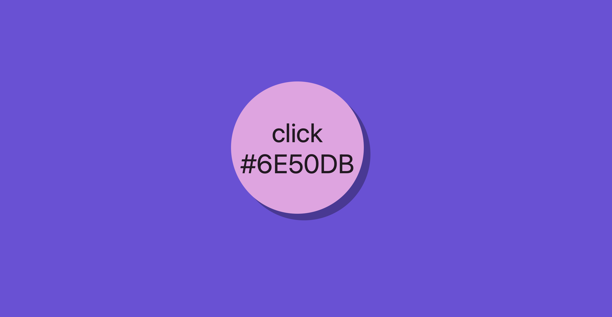

# Random Background Color

> A random background color with `click` functionalities.

## Table of contents

- [Random Background Color](#random-background-color)
  - [Table of contents](#table-of-contents)
  - [General info](#general-info)
  - [Screenshots](#screenshots)
  - [Technologies](#technologies)
  - [Setup](#setup)
  - [Code Examples](#code-examples)
  - [Status](#status)

## General info

> The objective of the project is to practice separation of concerns in
> JavaScript and use `setInterval` and `clearInterval` APIs.

## Screenshots



## Technologies

- JavaScript
- HTML5
- CSS3
- VS Code

## Setup

Clone the repo and run npm install.

## Code Examples

```js
    let randomColor = '#';
    for (let i = 0; i < 6; i++) {
        const randomIndex = Math.floor(Math.random() * characterArray.length); 
        randomColor += characterArray[randomIndex];
    }
```

## Status

Project is: _done_
